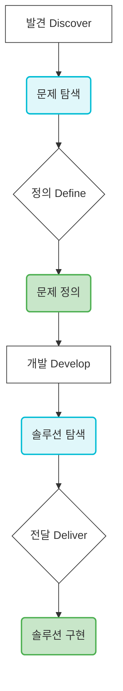

## ── 서비스 기획 원칙 완전판 ──

이 문서는 '서비스 기획의 기초' 강의 전문을 바탕으로, 기획자가 실무에서 쓰는 모든 원칙과 방법론을 빠짐없이 추출하여 정리한 것입니다. 마크다운 형식으로 제공되며, 실무에 바로 적용 가능한 체크리스트와 템플릿도 포함되어 있습니다.

---

# 🎯 서비스 기획 마스터 클래스: 실무 기획 역량 완전 정복

아이디어부터 프로토타입까지, 체계적인 서비스 기획 프로세스와 AI 도구 활용법을 배웁니다.

---

## 1. 서비스 기획의 중요성

### 🤔 왜 서비스 기획이 중요한가? (3대 이점)

개발 후 수정 비용은 기획 단계 수정 비용의 **10~100배** 이상입니다. 서비스 기획은 이러한 낭비를 줄이고 성공적인 서비스 구축을 위한 필수 과정입니다.

1.  **💸 비용 절감:**
    *   **기획 단계 수정:** 1시간
    *   **개발 중 수정:** 10시간
    *   **런칭 후 수정:** 100시간+
    *   초기에 문제를 발견하고 방향을 명확히 설정함으로써 불필요한 개발 시간과 비용 낭비를 막습니다.

2.  **🎯 방향성 정립:**
    *   **팀 전체가 같은 목표 공유:** 모든 이해관계자가 동일한 비전과 목표를 향해 나아갑니다.
    *   **의사결정 기준 명확화:** 어떤 기능을 우선순위로 둘지, 어떤 디자인을 채택할지 등 명확한 판단 기준을 제공합니다.
    *   **불필요한 기능 개발 방지:** 사용자의 진짜 문제 해결에 집중하여, 보여주기식 기능 개발을 막습니다.

3.  **❤️ 사용자 중심:**
    *   **진짜 문제 해결에 집중:** 사용자의 니즈와 고통(Pain Point)을 깊이 이해하고, 이에 기반한 해결책을 제시합니다.
    *   **사용자 니즈 기반 개발:** 사용자가 실제로 원하는 것을 개발하여 만족도를 높이고 이탈률을 낮춥니다.
    *   **시장 검증 후 투자:** 불확실한 아이디어에 무작정 투자하기보다, 시장과 사용자로부터 검증된 아이디어에 집중하여 리스크를 줄입니다.

> "기획 없이 개발하는 것은 지도 없이 여행하는 것과 같다. 어딘가에 도착하겠지만, 원하는 곳은 아닐 것이다."
> — 실리콘밸리 PM 격언

---

## 2. 서비스(Service)란 무엇인가?

목적을 가진 이용자가 목적을 달성할 수 있도록 도와주는 프로덕트 전체를 의미합니다.

*   **👤 이용자:** 목적을 가지고 서비스에 진입
*   **🎁 서비스:** 목적 달성을 돕는 모든 기능과 경험
*   **🎯 목적 달성:** 문제 해결 및 니즈 충족

**✅ 서비스 기획의 핵심 질문:**
"우리 서비스는 **누구의 어떤 목적**을 **어떻게** 달성하게 해주는가?"

**📖 예시:**

*   **🚕 카카오택시:**
    *   **이용자 목적:** 빠르게 이동하고 싶다
    *   **서비스:** 택시 호출, 결제, 도착 알림 등 이동 전반의 기능과 경험
*   **🍔 배달의민족:**
    *   **이용자 목적:** 맛있는 음식을 편하게 먹고 싶다
    *   **서비스:** 메뉴 탐색, 주문, 배달 추적 등 음식 주문 및 배달의 기능과 경험
*   **💰 토스:**
    *   **이용자 목적:** 쉽게 돈 관리하고 싶다
    *   **서비스:** 송금, 내역 조회, 자산 관리 등 금융 전반의 기능과 경험

---

## 3. 서비스 기획의 기본 프로세스: Double Diamond 프레임워크

서비스 기획은 **확산(Diverge)**과 **수렴(Converge)**을 반복하는 '더블 다이아몬드' 프레임워크를 따릅니다.



*   **🔍 확산 (Diverge):**
    *   가능한 많은 아이디어를 수집하고 다양한 관점에서 문제를 탐색합니다.
    *   판단을 유보하고 열린 마음으로 임하며, 양(Quantity)이 질(Quality)보다 우선합니다.
*   **🎯 수렴 (Converge):**
    *   수집된 아이디어 중 최선의 아이디어를 선별하고, 실현 가능성을 평가하여 우선순위를 결정하고 실행 계획을 수립합니다.

---

## 4. 서비스 생애주기 (Product Life Cycle)

모든 서비스는 **도입 → 성장 → 성숙 → 쇠퇴**의 사이클을 겪습니다. PM/PO/서비스 기획자는 각 단계에 맞는 목표를 설정하고 전략을 수립해야 합니다.

*   **도입기:** 시장 진입 및 인지도 구축에 집중합니다.
*   **성장기:** 빠른 성장과 시장 점유율 확대에 주력합니다.
*   **성숙기:** 최대 수익을 유지하며 시장 포화에 대응합니다.
*   **쇠퇴기:** 수요 감소 시 철수하거나 신규 서비스로 피벗(Pivot)을 고려합니다.

**🎯 서비스 기획자의 목표:**

*   **도입기:** 적절한 타이밍에 시장 진입 및 MVP(최소 기능 제품) 검증
*   **성장기:** 빠르게 성장할 수 있는 기능 확장 및 사용자 유치
*   **성숙기:** 최대한 오래 유지하며 수익 창출 및 차별화 전략 모색
*   **쇠퇴기:** 신규 서비스 피벗 또는 대대적인 리뉴얼

**⚠️ 생애주기 관리 실패/성공 사례:**

*   **싸이월드:** 성숙기에서 혁신 실패 → 쇠퇴
*   **카카오톡:** 지속적 혁신으로 성숙기 연장 중
*   **넷플릭스:** DVD → 스트리밍으로 성공적 피벗

---

## 5. PM, PO, 서비스 기획자 역할 차이

비슷해 보이지만 핵심 역할과 책임이 다릅니다. 스타트업에서는 한 사람이 여러 역할을 겸하는 경우가 많고, 대기업에서는 역할이 분리되어 전문화됩니다.

| 역할              | 주요 책임                         | 핵심 질문                      | 주요 KPI / 산출물           | 협업 대상 / 보고 대상 |
| :---------------- | :-------------------------------- | :----------------------------- | :-------------------------- | :------------------ |
| **🎯 PM**         | 제품 전체 책임자                  | "왜 이 제품을 만드는가?"       | 매출, MAU, 고객 획득 비용   | 경영진, 이사회      |
| (Product Manager) | 비즈니스 전략, 시장/경쟁사 분석, 로드맵, 우선순위 결정 |                                |                             |                     |
| **📋 PO**         | 제품 백로그 관리자                | "무엇을 먼저 만들 것인가?"     | 스프린트 완료율, 벨로시티   | 스크럼 마스터, 개발팀 |
| (Product Owner)   | 스프린트 백로그 우선순위, 스토리 작성, 수락 기준, 개발팀 요구사항 커뮤니케이션 |                                |                             |                     |
| **✏️ 서비스 기획자** | 서비스 설계 전문가                | "어떻게 만들 것인가?"          | 화면설계서, PRD, 스토리보드 | 디자이너, 개발자    |
|                   | 화면 설계, 기능 정의, 사용자 경험 시나리오, 개발 요구사항 명세 |                                |                             |                     |

**💡 서비스 기획자의 진짜 역할:**
핵심 비즈니스를 IT 기술이 가능한 형태로, 사용자 경험(UX)을 고려하여 설계하는 것입니다.

*   **💼 비즈니스 니즈:** "고객이 쉽게 결제할 수 있게 하자"
*   **→ ✏️ 서비스 기획자:** 번역 + 설계 + 최적화
*   **→ 💻 IT 구현:** "간편결제 API + 원터치 결제 UI"

**🧠 기획자가 고민해야 할 것:**

*   **🔄 기술적 실현 가능성:** 이 기능이 현재 기술로 구현 가능한가?
*   **👤 사용자 경험(UX):** 사용자가 3초 안에 이해할 수 있는가?
*   **⚖️ 비용 대비 효과:** 개발 공수 대비 비즈니스 임팩트는?

**🎨 좋은 기획의 특징:**

*   **📐 개발자가 바로 이해:** 추가 질문 없이 개발 착수 가능
*   **🎯 예외 케이스 커버:** 에러, 엣지 케이스 미리 정의
*   **💡 비즈니스 로직 명확:** 왜 이 기능이 필요한지 설명 가능

**🏗️ 서비스 기획자가 실제로 하는 일:**

수익 모델이 작동하도록 구조를 설계하고, 전략을 프로덕트로 구현합니다.

*   **💵 수익 모델 구조화:** 비즈니스 수익 모델이 실제로 작동하도록 설계 (결제 플로우, 과금 정책, 수익화 포인트 배치, A/B 테스트 최적화)
*   **🎯 전략 → 프로덕트 분할:** 큰 방향의 전략을 여러 프로덕트로 나눔 (전략 목표를 기능 단위로 분해, MVP 범위 정의, 릴리즈 로드맵 수립)
*   **⚙️ 업무 프로세스 설정:** 프로덕트 실행을 위한 프로세스 설계 (기획-개발-QA 워크플로우, 이해관계자 커뮤니케이션, 일정/리소스 조율)

**📊 예시: 쿠팡의 "로켓배송" 기획:**

*   **전략 (PM이 정의):** "빠른 배송으로 고객 충성도 확보"
*   **서비스 기획자가 구현:**
    *   로켓배송 뱃지 UI 설계
    *   배송 시간 표시 로직
    *   물류센터 재고 연동
    *   주문 마감 시간 안내

---

## 6. 서비스 기획자의 4대 핵심 역량 (상세)

이 4가지를 잘해야 진짜 서비스 기획자입니다. 사용자 경험(UX)을 기반으로 화면설계를 하고, 각 화면에서 작동할 기능정의를 하며, 이를 개발팀이 구현할 수 있도록 개발명세로 문서화합니다.

### 📱 1. 화면설계 (Screen Design)

사용자가 보고 조작하는 모든 인터페이스의 구조와 레이아웃을 설계합니다.

**📐 화면설계서에 포함되는 것:**

*   **🗂️ IA (Information Architecture):** 화면 구조도, 메뉴 체계, 네비게이션
*   **📄 와이어프레임:** 각 화면의 레이아웃과 컴포넌트 배치
*   **🔗 화면 흐름도 (Flow):** 화면 간 이동 경로, 조건 분기
*   **💬 UI 텍스트:** 버튼명, 안내 문구, 에러 메시지

**✅ 좋은 화면설계의 기준:**

*   **1화면 1목적:** 한 화면에서 하나의 핵심 액션만 수행하도록 합니다.
*   **3초 규칙:** 사용자가 3초 안에 무엇을 해야 할지 파악할 수 있어야 합니다.
*   **일관성:** 동일한 패턴은 동일한 위치와 방식으로 작동하도록 합니다.
*   **피드백:** 모든 사용자 액션에 대해 명확한 반응이 있어야 합니다.
*   **에러 방지:** 사용자가 실수하기 어려운 구조로 설계합니다.

**⚠️ 흔한 실수:**

*   예외 케이스(빈 화면, 에러) 미설계
*   실제 데이터 길이 미고려 (텍스트 잘림 등)
*   로딩/전환 상태 누락

**🤖 AI로 화면설계하기:**

AI를 활용해 화면 구조를 빠르게 설계하고 검증할 수 있습니다.

*   **화면 구조 설계 프롬프트 (IA):**
    ```
    "[중고거래 앱] 의 화면 구조(IA)를 설계해줘.
    1. 메인 탭 구성 (4-5개)
    2. 각 탭별 하위 화면 목록
    3. 화면 간 이동 흐름
    4. 모달/팝업이 필요한 케이스
    5. 공통 컴포넌트 (헤더, 탭바, 토스트)
    트리 구조로 시각화해줘."
    ```
*   **상세 화면 설계 프롬프트:**
    ```
    "[상품 상세 페이지] 화면을 설계해줘. 포함할 내용:
    1. 화면 레이아웃 (상단/중단/하단)
    2. 각 영역별 컴포넌트 목록
    3. 사용자 액션 (버튼, 스와이프 등)
    4. 상태별 화면 (로딩, 빈 값, 에러)
    5. 연결되는 이전/다음 화면
    6. UI 텍스트 초안
    ASCII로 간단히 그려줘."
    ```
*   **AI 검증 팁:**
    ```
    "이 화면설계에서 누락된 상태 (로딩, 에러, 빈 화면)가 있는지 체크해줘.
    그리고 UX 개선점 3가지 제안해줘."
    ```

**실습: 화면설계 체크리스트**

*   내 서비스의 핵심 화면 5개 선정
*   AI에게 IA 구조 요청 (위 프롬프트 활용)
*   핵심 화면 1개 상세 설계 요청 (위 프롬프트 활용)
*   종이에 와이어프레임 스케치
*   예외 케이스 3가지 추가 (빈 화면, 에러, 로딩)

### ⚙️ 2. 기능정의 (Feature Definition)

서비스가 제공하는 모든 기능을 구체적으로 명세합니다.

**📝 기능정의서 구성요소:**

1.  **기능명 & ID:** 명확한 기능 이름과 고유 식별자 (예: F001_로그인)
2.  **기능 설명:** 무엇을 하는 기능인지 한 문장으로 정의
3.  **입력/출력 (I/O):** 사용자가 입력하는 것, 시스템이 보여주는 것
4.  **비즈니스 규칙:** 조건, 제약사항, 계산 로직
5.  **예외 처리:** 에러 상황과 대응 방법

**📋 기능정의 예시: 쿠폰 적용 기능**

| 항목         | 내용                                  |
| :----------- | :------------------------------------ |
| **ID**       | F012_ApplyCoupon                      |
| **설명**     | 주문 시 쿠폰을 적용하여 할인          |
| **입력**     | 쿠폰 코드, 주문 금액                  |
| **출력**     | 할인 금액, 최종 결제 금액             |
| **규칙**     | • 최소 주문 금액 충족 시만 • 중복 사용 불가 • 유효기간 내 사용 |
| **예외**     | • 무효 쿠폰 → 에러 메시지 • 최소 금액 미달 → 안내 |

**🤖 AI로 기능정의하기:**

AI를 활용해 기능 명세를 빠르게 작성하고 빈틈을 찾을 수 있습니다.

*   **기능 목록 도출 프롬프트:**
    ```
    "[음식 배달 앱] 의 MVP에 필요한 기능 목록을 도출해줘. 카테고리별로 분류:
    1. 사용자 관리 (회원가입, 로그인 등)
    2. 메뉴 탐색 (검색, 필터 등)
    3. 주문 프로세스 (장바구니, 결제 등)
    4. 배달 관리 (추적, 완료 등)
    5. 기타 (알림, 설정 등)
    각 기능별 우선순위(P0/P1/P2)도 표시해줘."
    ```
*   **기능 상세 명세 프롬프트:**
    ```
    "[장바구니 담기] 기능을 상세 정의해줘. 포함할 내용:
    1. 기능 ID와 설명
    2. 사전조건 (Pre-condition)
    3. 입력값과 출력값
    4. 처리 로직 (step by step)
    5. 비즈니스 규칙 (수량 제한, 재고 등)
    6. 예외 케이스 5가지 이상
    7. 연관 기능 목록"
    ```
*   **AI 검증 팁:**
    ```
    "이 기능정의에서 빠진 예외 케이스 를 찾아줘. 특히 네트워크 오류, 동시 접속, 권한 문제 관점에서."
    ```

**실습: 기능정의 체크리스트**

*   내 서비스의 핵심 기능 10개 목록 작성
*   AI에게 우선순위 평가 요청 (위 프롬프트 활용)
*   P0 (최우선) 기능 1개 상세 명세 작성
*   AI에게 누락된 예외 찾아달라고 요청 (위 프롬프트 활용)
*   예외 처리 보완

### ❤️ 3. 사용자경험 (User Experience)

사용자가 서비스를 사용하면서 느끼는 모든 감정과 인상을 설계합니다.

**🎯 UX 설계 영역:**

*   **🧭 사용성 (Usability):** 쉽게 배우고, 효율적으로 사용할 수 있는가?
*   **🎨 심미성 (Aesthetics):** 보기 좋고, 브랜드와 일관성이 있는가?
*   **⚡ 반응성 (Responsiveness):** 빠르게 반응하고, 피드백이 명확한가?
*   **🔒 신뢰성 (Credibility):** 믿을 수 있고, 안전하다고 느끼는가?
*   **♿ 접근성 (Accessibility):** 누구나 (장애인 포함) 사용할 수 있는가?

**🧠 UX 심리학 핵심 원칙:**

*   **힉스 법칙 (Hick's Law):** 선택지가 많으면 결정 시간이 증가한다. (ex: Netflix의 추천 그룹화)
*   **피츠 법칙 (Fitts' Law):** 중요한 버튼은 크고 가까이 있어야 빨리 누를 수 있다. (ex: 카카오톡 전송 버튼)
*   **밀러의 법칙 (Miller's Law):** 정보는 7±2개 단위로 그룹화해야 기억하기 쉽다. (ex: 신용카드 번호 4자리씩 그룹화)
*   **제이콥의 법칙 (Jakob's Law):** 사용자는 익숙한 패턴을 기대한다. (ex: 쇼핑카트 아이콘은 오른쪽 상단)
*   **폰 레스토프 효과 (Von Restorff Effect):** 다르게 보이는 것이 기억에 남는다. (ex: 할인 배지, 강조 색상의 CTA 버튼)
*   **도허티 임계 (Doherty Threshold):** 시스템 응답이 0.4초 이내여야 몰입이 유지된다. (ex: 스켈레톤 UI, 빠른 로딩)

**💡 UX 체크 질문:**
"사용자가 이 화면에서 3초 안에 무엇을 해야 할지 알 수 있는가?"

**🤖 AI로 UX 설계 및 검증하기:**

AI를 UX 컨설턴트처럼 활용해 경험을 개선할 수 있습니다.

*   **UX 시나리오 설계 프롬프트:**
    ```
    "[첫 주문을 하는 신규 사용자] 의 UX 시나리오를 설계해줘.
    1. 사용자 목표
    2. 진입 경로 (어디서 왔나?)
    3. 단계별 행동과 감정
    4. 각 단계의 Pain Point
    5. 이탈 가능 지점
    6. 개선 아이디어
    감정 곡선도 함께 그려줘."
    ```
*   **UX 심리학 검증 프롬프트:**
    ```
    "내가 설계한 [결제 화면] 을 UX 심리학 원칙으로 평가해줘. 화면 설명:
    - 상단: 주문 요약 (3개 상품)
    - 중단: 결제 수단 선택 (5개 옵션)
    - 하단: 쿠폰 입력, 최종 금액, 결제 버튼
    평가 기준:
    1. 힉스 법칙 (선택지 개수)
    2. 피츠 법칙 (버튼 크기/위치)
    3. 밀러의 법칙 (정보 그룹화)
    4. 각 항목 점수와 개선안"
    ```
*   **AI 페르소나 테스트:**
    ```
    "너는 50대 스마트폰 초보 사용자 야. 내가 만든 앱의 [회원가입 화면]을 처음 보고 느끼는 점을 솔직하게 말해줘.
    어떤 부분이 헷갈리고, 어디서 막히는지."
    ```

**실습: UX 개선 체크리스트**

*   내 서비스의 핵심 플로우 정의
*   AI에게 UX 시나리오 작성 요청 (위 프롬프트 활용)
*   도출된 Pain Point 3개 선정
*   AI에게 개선 아이디어 요청 (위 프롬프트 활용)
*   개선안 중 Quick Win 1개 선정

### 📋 4. 개발명세 (Dev Specification)

개발자가 구현할 수 있는 명확한 요구사항을 작성합니다. 이는 기능정의와 화면설계의 모든 디테일을 개발팀이 이해할 수 있는 언어로 번역하는 과정입니다.

**📋 개발명세 포함 내용 (예시):**

*   **API 엔드포인트:** 어떤 데이터를 주고받을지 명세 (HTTP Method, URL, Request/Response Body)
*   **DB 스키마:** 필요한 데이터베이스 테이블 구조 및 필드 정의
*   **예외 처리 로직:** 에러 발생 시 시스템이 어떻게 반응해야 하는지 상세 명세
*   **동시성 처리:** 여러 사용자가 동시에 접근했을 때 데이터 일관성을 어떻게 유지할지
*   **성능 요구사항:** 각 기능의 응답 시간, 처리량 등 (예: "결제 완료 후 1초 이내 화면 전환")
*   **보안 요구사항:** 데이터 암호화, 인증/인가 방식 등
*   **테스트 케이스:** 각 기능이 의도대로 작동하는지 확인할 시나리오 (Acceptance Criteria와 연결)

**💡 4가지 역량의 관계:**
**사용자경험(UX)** 을 기반으로 **화면설계** 를 하고, 각 화면에서 작동할 **기능정의** 를 하며, 이를 개발팀이 구현할 수 있도록 **개발명세** 로 문서화합니다.

**🏋️ 종합 실습: "좋아요" 기능 기획하기 (AI 활용)**

SNS 앱의 "좋아요" 기능을 4대 역량 관점에서 완성하는 프롬프트 예시:

```
"SNS 앱의 [좋아요] 기능을 서비스 기획자 관점에서 완성해줘. 4가지 관점으로 정리:
1. **화면설계**: 와이어프레임, UI 상태(기본/활성/비활성), 애니메이션 (ASCII로 간단히 그려줘)
2. **기능정의**: 상세 로직, 비즈니스 규칙, 예외 케이스 10개 (오프라인, 동시성, 오류 등)
3. **사용자경험**: UX 시나리오, 피드백 설계(즉각적/지연), 접근성 고려
4. **개발명세**: REST API 스펙(POST/DELETE /likes/{postId}), DB 스키마(user_id, post_id, created_at), 테스트 케이스 5개
각 관점별로 개발자가 바로 구현할 수 있는 수준으로 상세하게."
```

---

## 7. 서비스 기획 상세 프로세스: 5일 학습 플로우

이 강의는 5일 동안 디자인 씽킹과 린 스타트업의 원칙을 바탕으로 아이디어부터 프로토타입까지 체계적인 기획 프로세스를 경험합니다.

### Day 1: 문제 발견 (Discover - Empathize & Define)

**🎯 학습 목표:** 좋은 문제의 조건을 이해하고, AI를 활용하여 문제를 발굴하며, 사용자 관점에서 문제를 공감하고 정의합니다.

**1. 문제 발견의 중요성:**

*   "왜 문제 발견이 먼저인가?" 해결책보다 문제가 먼저입니다. (P106)
*   스타트업 실패 원인 1위는 "시장이 원하지 않는 것을 만듦"입니다.
*   **핵심 질문:** "이 문제가 해결되면 누가, 얼마나 행복해지는가?"

**2. 문제 탐색:**

*   **어디서 문제를 찾을까?** (P107)
    *   **내가 겪는 문제:** 깊이 이해, 강한 해결 동기, 첫 사용자 자신. (예: 토스, 당근마켓)
    *   **주변에서 발견한 문제:** 넓은 시장, 객관적 관점, 인터뷰 검증. (예: 배민, 마켓컬리)
*   **좋은 문제의 3가지 조건:** (P107)
    1.  **빈번함:** 자주 겪는 문제인가?
    2.  **고통스러움:** 해결 안 되면 괴로움/짜증이 심한가?
    3.  **돈/시간 투자:** 이미 해결하려 노력 중이거나 기꺼이 돈/시간을 지불할 의향이 있는가?

**3. AI를 활용한 문제 리서치 (Deep Research):**

AI는 시장 조사와 문제 발굴의 게임 체인저입니다.

*   **AI 리서치 꿀조합:** (P108, 112)
    1.  **Gemini Deep Research (시장 전체 파악):** 수십 개 웹사이트 자동 분석, 긴 보고서, 출처 명시. (시장 규모, 트렌드, 경쟁사 현황)
        *   **프롬프트 예시:**
            ```
            "[1인 가구 식사 문제] 에 대해 심층 조사해줘.
            1. 1인 가구 현황 (한국 기준, 최신 통계)
            2. 1인 가구가 겪는 식사 관련 문제들
            3. 현재 이 문제를 해결하려는 서비스들
            4. 각 서비스의 한계점
            5. 아직 해결되지 않은 Pain Point
            6. 시장 규모와 성장률
            출처를 포함해서 보고서 형태로 정리해줘."
            ```
    2.  **Perplexity Pro (빠른 팩트 체크):** 실시간 웹 검색 + AI 분석, 빠른 답변, 후속 질문. (경쟁사 현황, 최신 뉴스, 특정 기업/서비스 조사)
        *   **프롬프트 예시:**
            ```
            "[직장인 점심 메뉴 결정] 문제에 대해:
            1. 이 문제를 겪는 사람이 얼마나 많아?
            2. 관련 커뮤니티 반응은? (블라인드, 인스타 등)
            3. 이미 있는 해결책은?
            4. 그 해결책들의 평점/리뷰는?
            5. 사람들이 여전히 불만인 점은?
            최신 정보 위주로 알려줘."
            ```
    3.  **ChatGPT / Claude (정리 및 인사이트 도출):** 대화형 브레인스토밍, 아이디어 확장, 문서 정리. (문제 구체화, 해결책 아이디어)
        *   **레딧/커뮤니티 검색 (Perplexity 활용):** (P111) 사람들이 돈 주고도 해결 못 하는 진짜 문제와 솔직한 불만을 찾습니다.
            ```
            "reddit에서 [직장인 점심 메뉴] 관련 게시글을 검색해줘. 찾아야 할 것:
            1. 가장 많이 공감받은 불만/고민 글
            2. 사람들이 시도한 해결책들
            3. 그 해결책의 문제점/한계
            4. "이런 게 있으면 좋겠다" 요청
            5. 관련 서브레딧 추천
            한글로 요약해줘."
            ```

**4. 시장조사 초도자료 (템플릿):** (P113) AI로 수집한 정보를 한 페이지로 정리합니다.

*   **문제 정의:** 한 문장으로 정리
*   **타겟 규모:** 몇 명이 겪는지 (TAM/SAM/SOM)
*   **커뮤니티 목소리:** 레딧/블라인드 핵심 인용 3개
*   **기존 해결책:** 경쟁 서비스 3개 + 한계
*   **기회 영역:** 아직 해결 안 된 Pain Point

**5. 문제 검증 체크리스트:** (P114) 발견한 문제가 진짜 문제인지 확인합니다.

*   **빈도:** 일주일에 1번 이상 겪는 문제인가?
*   **강도:** 짜증나거나 스트레스 받는 문제인가?
*   **규모:** 나 말고 다른 사람도 겪는가?
*   **지불의향:** 돈 내고라도 해결하고 싶은가?
*   **대안 불만:** 기존 해결책이 불편한가?

**6. 디자인 씽킹 (Design Thinking):** (P23, 115) 사용자 중심으로 문제를 정의하고 창의적 해결책을 찾는 방법론입니다.

*   **❤️ 1단계: 공감 (Empathize):** (P24, 116) 사용자의 입장이 되어보기 (관찰, 인터뷰, 직접 체험)
    *   **공감 지도 (Empathy Map) 템플릿:** (P24, 117) 사용자를 4가지 관점(See, Hear, Say & Do, Think & Feel)과 Pain/Gain으로 이해합니다.
        *   **프롬프트 예시:**
            ```
            "[점심 메뉴 고민하는 직장인] 의 공감 지도를 만들어줘.
            4가지 관점으로: 1. 보는 것 (See) 2. 듣는 것 (Hear) 3. 말과 행동 (Say & Do) 4. 생각과 느낌 (Think & Feel)
            그리고: - Pain (고통/불만) 3개 - Gain (원하는 것) 3개 표로 정리해줘."
            ```
*   **🎯 2단계: 정의 (Define):** (P24, 118) 공감에서 발견한 것을 "해결해야 할 문제"로 한 문장으로 정리합니다.
    *   **POV (Point of View) 문장 템플릿:** (P24, 118)
        `[사용자] 는 [니즈] 가 필요하다. 왜냐하면 [인사이트] 이기 때문이다.`
    *   **HMW (How Might We) 질문 템플릿:** (P24, 119) POV를 질문 형태로 바꾸기. "우리가 어떻게 하면 ~할 수 있을까?"
        *   **좋은 HMW 질문의 3원칙:** (P120) 골디락스 존 (너무 넓지도 좁지도 않게), 솔루션 열어두기, 긍정적 프레임.
        *   **HMW 변형 기법:** (P121) 부정→긍정, 극단 상상, 형용사 교체, 자원 활용, 유추/비유.
        *   **프롬프트 예시:**
            ```
            "다음 공감 지도 결과를 바탕으로: Pain: [점심 메뉴 고민에 30분 낭비] Gain: [빠르고 건강한 선택] 타겟: [30대 직장인]
            1. POV 문장 3개 만들어줘 형식: [사용자]는 [니즈]가 필요하다. 왜냐하면 [인사이트]이기 때문이다.
            2. 각 POV에서 HMW 질문 2개씩 형식: 우리가 어떻게 하면 ~할 수 있을까?"
            ```
            ```
            "다음 POV를 5가지 방식으로 HMW 질문으로 바꿔줘:
            POV: [바쁜 직장인은 점심시간에 빠른 메뉴 결정이 필요하다]
            1. 부정→긍정 2. 극단 상상 3. 형용사 교체 4. 자원 활용 5. 유추/비유
            각각 HMW 질문 2개씩 만들어줘."
            ```

### Day 2: 문제 정의 & 분석 (Define & Research)

**🎯 학습 목표:** 발견한 문제를 명확히 정의하고, 경쟁사를 분석하며, 현재 고객 여정을 파악합니다.

**1. 5 Whys (다섯 번의 왜?):** (P52-54, 133-134)
문제의 진짜 근본 원인(Root Cause)을 찾기 위해 "왜?"를 5번 반복하는 기법입니다.

*   **프롬프트 예시:**
    ```
    "[직장인들이 점심 메뉴 정하기 어려워함] 이라는 문제에 대해 5 Whys 분석을 해줘.
    각 Why마다: 1. 질문과 답변 2. 이 단계에서 발견한 인사이트 3. 가능한 솔루션 아이디어
    마지막에 근본 원인(Root Cause)과 이를 해결하는 서비스 아이디어 3개를 제안해줘."
    ```
*   **실습:** Day 1 문제에 5 Whys 적용 후 AI 결과와 비교.

**2. Problem Statement (문제 진술문) 작성:** (P135-136, 159-160)
"우리가 풀 문제"를 한 문장으로 명확하게 정리하는 것입니다.

*   **Problem Statement 공식:**
    `[누가] 는 [언제/어디서] [뭐가 불편한지] 를 겪는다. 왜냐하면 [원인] 때문이다.`
*   **체크리스트:** 누가 명확한가? 숫자(측정 가능)가 있는가? 원인이 있는가? "앱"이라는 말이 안 들어가 있는가?
*   **프롬프트 예시:**
    ```
    "다음 정보를 바탕으로 Problem Statement를 작성해주세요.
    [수집된 정보] - 타겟: 서울 강남권 20-30대 직장인 - 상황: 점심시간 12-1시, 동료 2-4명과 식사 - 불편함: 매일 "뭐 먹지?" 논쟁에 15분 소비 - 인터뷰 인사이트: "검색해도 다 비슷해 보임"
    [작성 조건] 1. 공식 사용 2. 솔루션을 암시하지 않기 3. 측정 가능한 표현 사용 4. 3가지 버전으로 작성."
    ```

**3. Pain & Gain 분석:** (P137-138)
고객이 "뭐가 싫고(Pain)", "뭘 원하는지(Gain)"를 정리합니다.

*   **Pain (싫은 것):** 시간 낭비, 돈 낭비, 감정적 불편함 등 피하고 싶은 것.
*   **Gain (원하는 것):** 시간 절약, 만족감, 편리함, 인정 등 얻고 싶은 것.
*   **핵심:** Pain 해결 = 필수 기능 / Gain 제공 = 차별화 기능.
*   **프롬프트 예시:**
    ```
    "다음 타겟 고객의 Pain과 Gain을 분석해주세요.
    [타겟 고객] 서울 강남권 20-30대 직장인 점심시간에 동료들과 맛집을 찾는 상황
    [분석 요청] 1. Pains 분석 (기능적/감정적/보조적) 2. Gains 분석 (필수/기대/희망) 3. 우선순위 매기기 (Extreme Pain Top 3, Essential Gain Top 3)
    [출력 형식] 표 형태 + 각 항목에 강도(1-5) 표시."
    ```

**4. As-Is Journey Map (현재 여정 지도):** (P139-140)
고객이 "지금 어떻게 하고 있는지"를 단계별로 그려봅니다.

*   **포함 요소:** 단계, 행동, 사용 채널, 생각, 감정, Pain Point, 개선 기회.
*   **핵심:** 감정이 나빠지는 Pain Point 구간이 곧 우리 서비스의 기회입니다.
*   **프롬프트 예시:**
    ```
    "당신은 서비스 디자인 전문가 입니다. 다음 상황의 As-Is Customer Journey Map을 작성해주세요.
    [고객 상황] 페르소나: 29세 마케터 김지현, 강남 직장인 목표: 점심시간에 동료 3명과 맛있는 식사
    [Journey Map 구성] 5-7단계: 단계명, 구체적 행동, 사용 채널/터치포인트, 생각, 감정, Pain Point, 개선 기회
    [출력 형식] 1. 표 형태 2. 감정 곡선 그래프 (텍스트) 3. 가장 심각한 Pain Point Top 3 4. 각 Pain Point별 개선 기회."
    ```

**5. 역기획 (Reverse Engineering):** (P129-149)
성공한 서비스를 분해하여 "왜 이렇게 만들었을까?"를 역추적하며 배우는 가장 빠른 방법입니다.

*   **역기획의 5가지 분석 레이어:** (P132)
    1.  **IA (Information Architecture) - 정보 구조:** 앱의 전체 메뉴 구조, 화면 계층, 네비게이션 패턴. (P133-134)
    2.  **User Flow - 사용자 흐름:** 핵심 태스크 완료까지의 경로, 클릭 수, 분기점. (P135-136)
    3.  **UI/UX 패턴 - 디자인 요소:** 버튼 배치, 색상, 마이크로인터랙션, 온보딩. (P137)
    4.  **기능 스펙 - 기능별 상세:** 입력/출력, 예외 처리, 데이터 연동. (P138)
    5.  **비즈니스 로직 - 수익 모델:** 가격 정책, 수수료 구조, 구독 모델, 광고. (P139)
*   **역기획 예시:** 토스 IA, 배민 주문 Flow, 당근마켓 핵심 UX, 카카오톡 메시지 Flow. (P140-147)
*   **역기획 Value-Add 전략:** (P144) 분석에서 끝나지 않고, Pain Point 개선, 기능 확장, 타겟 세분화를 통해 더 나은 서비스를 만드는 아이디어 도출.
*   **역기획 보고서 템플릿:** (P149)

    ```markdown
    ### [서비스명] 역기획 보고서

    **작성자:** OOO | **작성일:** 2024.XX.XX

    **1. 서비스 개요**
    *   서비스명:
    *   한 줄 설명:
    *   타겟 사용자:
    *   핵심 가치:

    **2. 수익 모델**
    *   주요 수익원:
    *   과금 방식:
    *   예상 객단가:

    **3. IA 구조**
    [트리 구조 이미지 또는 ASCII 아트 삽입]

    **4. 핵심 User Flow**
    [플로우 차트 이미지 또는 ASCII 아트 삽입]

    **5. UX 강점 (3가지)**
    *   강점 1: [내용]
    *   강점 2: [내용]
    *   강점 3: [내용]

    **6. 개선점 & 아이디어**
    *   개선점 1 → 아이디어:
    *   개선점 2 → 아이디어:
    *   개선점 3 → 아이디어:
    ```

**6. 비즈니스 환경 분석:**

*   **3C 분석 (Customer, Company, Competitor):** (P150) 시장을 입체적으로 바라보는 기본적인 프레임워크.
    *   **Company (자사):** 핵심 역량, 보유 자원, 브랜드 인지도.
    *   **Customer (고객):** 니즈, Pain Point, 구매 결정 요인.
    *   **Competitor (경쟁사):** 강점/약점, 시장 점유율, 차별화.
    *   **프롬프트 예시:**
        ```
        "[서비스명/아이디어] 에 대한 3C 분석을 해줘.
        1. Company: 스타트업 초기 단계라고 가정하고, 필요한 핵심 역량과 자원 분석
        2. Customer: 타겟 고객 세그먼트 3개와 각각의 특성
        3. Competitor: 직접 경쟁사 3개, 간접 경쟁사 2개 분석 (각 경쟁사의 강점/약점 포함)
        분석 결과를 표로 정리해주고, 3C 분석 기반 전략적 시사점 3가지도 도출해줘."
        ```
*   **SWOT 분석 (Strength, Weakness, Opportunity, Threat):** (P151) 내부(강점/약점) 및 외부(기회/위협) 환경을 체계적으로 분석.
    *   **프롬프트 예시:**
        ```
        "[서비스명] 의 SWOT 분석을 해줘. 각 항목별로 5개씩 분석하고, 2x2 매트릭스로 정리해줘.
        추가로 SWOT 기반 전략도 제안해줘: SO, WO, ST, WT 전략."
        ```
*   **4P 마케팅 믹스 (Product, Price, Place, Promotion):** (P152) 마케팅 전략 프레임워크.
    *   **프롬프트 예시:**
        ```
        "[카카오페이, 토스, 네이버페이] 를 4P 관점에서 비교 분석해줘.
        표 형식으로 정리하고, 각 서비스의: 1. 핵심 차별화 포인트 2. 주요 수익 모델 3. 고객 획득 전략 4. 시장 포지셔닝 을 분석해줘.
        후발주자가 진입할 수 있는 시장 공백(Gap)도 찾아줘."
        ```
*   **MoSCoW 우선순위 프레임워크:** (P153) 기능의 중요도를 명확하게 분류하여 MVP 정의의 핵심으로 사용.
    *   **Must Have:** 없으면 서비스 안 됨 (MVP 필수)
    *   **Should Have:** 중요하지만 없어도 MVP 가능 (1차 버전 이후)
    *   **Could Have:** 있으면 좋지만 우선순위 낮음 (리소스 여유 시)
    *   **Won't Have:** 이번 버전에서는 안 함 (명시적 제외)
    *   **프롬프트 예시:**
        ```
        "새로운 배달 앱을 만들려고 해. 다음 기능들을 MoSCoW로 분류해줘:
        1. 음식점 검색/필터 2. 장바구니 3. 결제 4. 실시간 배달 추적 5. 리뷰/별점 6. 쿠폰/프로모션
        각 분류의 이유와 함께 표로 정리해줘. MVP(1차 출시)에 포함될 기능 목록도 명확히 해줘."
        ```

### Day 3: 비즈니스 모델 정의 (Define & Ideate)

**🎯 학습 목표:** 고객이 진짜 원하는 것을 파악하고, 비즈니스 모델을 정의하며, 아이디어를 발산하고 수렴합니다.

**1. JTBD (Jobs To Be Done) 프레임워크:** (P161)
"고객은 드릴을 사는 게 아니라 벽에 구멍을 사는 것이다." 고객이 해결하려는 진짜 과업(Job)에 집중합니다.

*   **JTBD 문장 구조:** `[상황] 에서 나는 [동기/목표] 를 원하기 때문에 [기대 결과] 을 얻고 싶다.`
*   **세 가지 Job 유형:**
    *   **Functional Job (기능적 과업):** 물리적/실용적 목표 (예: "점심 빨리 해결하고 싶다")
    *   **Emotional Job (감정적 과업):** 감정적 목표 (예: "친구들에게 인정받고 싶다")
    *   **Social Job (사회적 과업):** 사회적 목표 (예: "그룹 내에서 영향력을 보여주고 싶다")
*   **프롬프트 예시:**
    ```
    "[서비스명/아이디어] 의 타겟 고객이 가진 Jobs To Be Done을 분석해줘.
    1. Functional Job 3가지 2. Emotional Job 3가지 3. Social Job 2가지
    각 Job별로: - 현재 어떻게 해결하고 있는지 - 기존 솔루션의 한계점 - 우리가 제공할 수 있는 더 나은 방법."
    ```

**2. VPC (Value Proposition Canvas):** (P60-61, 162-162-B)
고객이 진짜 원하는 것(Customer Profile)과 우리가 줄 수 있는 것(Value Map)을 정확히 매칭하는 도구입니다. JTBD의 Jobs는 VPC의 Customer Jobs로 연결됩니다.

*   **고객 프로필 (오른쪽):**
    *   **Customer Jobs (할 일):** 고객이 달성하려는 목표
    *   **Pains (고통):** 목표 달성을 방해하는 것
    *   **Gains (이득):** 고객이 원하는 혜택
*   **가치 맵 (왼쪽):**
    *   **Products & Services:** 우리가 제공할 솔루션
    *   **Pain Relievers (진통제):** 고객의 고통을 해결
    *   **Gain Creators (비타민):** 기대 이상의 가치를 제공
*   **프롬프트 예시:**
    ```
    "[서비스명]의 Value Proposition Canvas를 작성해줘.
    ## 고객 프로필 (오른쪽) 타겟 고객: [타겟 설명]
    1. Customer Jobs 5개 2. Pains 5개 3. Gains 5개
    ## 가치 맵 (왼쪽)
    1. Products & Services 5개 2. Pain Relievers 5개 3. Gain Creators 5개
    ## Fit 분석 - Pain과 Pain Reliever, Gain과 Gain Creator가 매칭되는지 확인. 매칭 안 되는 항목 = 개선 필요 포인트.
    표 형식으로 정리해줘."
    ```

**3. 아이디어 발상 기법 (확산 - Diverge):** (P140-143, 162-C)
HMW 질문에 대한 창의적인 솔루션 아이디어를 도출합니다.

*   **SCAMPER 기법:** (P140-141) 기존 제품/서비스를 7가지 관점(Substitute, Combine, Adapt, Modify, Put to other uses, Eliminate, Reverse)으로 변형.
    *   **프롬프트 예시:**
        ```
        "[HMW 질문: 어떻게 하면 사용자가 3분 안에 메뉴를 결정하게 할 수 있을까?]
        SCAMPER 기법으로 아이디어 10개를 제안해줘. 각 기법별로 한 줄 설명과 실현가능성 표시."
        ```
*   **Crazy 8's:** (P162-C) A4 용지를 8칸으로 접어 8분 안에 8개 아이디어를 스케치.
*   **Brainwriting:** (P162-C) 각자 3개 적고 옆 사람에게 넘겨 발전시키기.
*   **강제연결법 (Random Input):** (P142) 무작위 단어와 문제를 강제로 연결.
    *   **프롬프트 예시:**
        ```
        "다음 문제와 랜덤 키워드를 강제로 연결해서 창의적인 솔루션 아이디어 5개를 만들어줘.
        문제: [점심 메뉴 고르기 어려움] 랜덤 키워드: [게임, 날씨, SNS, 로또, 여행]
        각 연결에 대해: 1. 연결 아이디어 2. 구체적 기능 3. 예상 사용자 반응."
        ```
*   **역발상 (Reverse Thinking):** (P142) 기존 가정을 완전히 뒤집어 생각하여 새로운 아이디어를 발견.
    *   **프롬프트 예시:**
        ```
        "다음 서비스의 기존 가정 5가지를 나열하고, 각각을 뒤집은 역발상 아이디어를 만들어줘. 서비스: [맛집 추천 앱]."
        ```
*   **마인드맵 & 트렌드 결합:** (P143) 중심 주제에서 가지치기로 연상 확장하고, 최신 기술/트렌드를 결합.
    *   **프롬프트 예시:**
        ```
        "[점심 메뉴 고민] 을 중심으로 마인드맵을 3단계 depth로 그려줘.
        1단계: 핵심 키워드 5개 2단계: 각 키워드별 하위 개념 3개씩 3단계: 각 하위 개념별 구체 아이디어 2개씩."
        ```
        ```
        "다음 문제에 2024-2025 트렌드를 결합해 혁신적인 솔루션 아이디어를 만들어줘.
        문제: [점심 메뉴 선택 어려움] 결합할 트렌드: AI/LLM, AR/VR, 숏폼, 구독경제, 게이미피케이션."
        ```

**4. 아이디어 수렴: 평가 및 선정 (Converge):** (P144, 162-D)
발산한 아이디어 중 실행할 것을 체계적으로 선택합니다.

*   **Impact-Effort 매트릭스:** (P144, 162-D) 아이디어를 **높은 효과, 적은 노력 (Quick Win)**, **높은 효과, 많은 노력 (Major Project)**, **낮은 효과, 적은 노력 (Fill-In)**, **낮은 효과, 많은 노력 (Avoid)**으로 분류.
    *   **프롬프트 예시:**
        ```
        "아래 아이디어들을 Impact-Effort Matrix로 평가해줘. 아이디어 목록: [아이디어 1~10 나열]
        평가 기준: Impact (1-10), Effort (1-10). 표로 정리하고, Quick Win부터 추천해줘."
        ```
*   **Dot Voting:** (P162-D) 팀원마다 스티커 3개씩을 주고 좋다고 생각하는 아이디어에 붙여 가장 많은 스티커를 받은 아이디어를 선택.
*   **RICE 스코어링:** (P90) Reach(영향받는 사용자 수), Impact(임팩트 크기), Confidence(확신 정도), Effort(필요한 노력)를 기준으로 점수를 매겨 우선순위 결정. `점수 = (R × I × C) / E`
*   **2x2 매트릭스 (우선순위):** (P90) Impact-Effort 매트릭스와 유사.

**5. 비즈니스 모델 캔버스 (BMC):** (P59, 64, 163)
사업 구조를 한 장으로 정리하는 프레임워크. 이미 잘 돌아가는 사업을 정리하거나, 성공 사례를 분석하는 데 유용. (핵심 파트너, 핵심 활동, 가치 제안, 고객 관계, 고객 세그먼트, 핵심 자원, 채널, 비용 구조, 수익원)

*   **프롬프트 예시 (기존 서비스 분석용):**
    ```
    "[유명 서비스명, 예: 배달의민족] 의 비즈니스 모델 캔버스를 분석해줘.
    9개 블록 각각에 대해: - 구체적인 내용 3-5개 - 다른 블록과의 연관성 - 이 회사가 성공한 핵심 요인.
    이 BMC에서 우리가 참고할 수 있는 포인트도 알려줘."
    ```

**6. 시장 규모 추정 (TAM/SAM/SOM/LAM):** (P163, 200-204)
투자자가 가장 먼저 묻는 질문인 "이 시장이 얼마나 큰가?"를 숫자로 보여주는 방법.

*   **TAM (Total Addressable Market):** 전체 시장 규모.
*   **SAM (Serviceable Available Market):** 우리가 타겟하는 시장.
*   **SOM (Serviceable Obtainable Market):** 현실적으로 확보 가능한 시장.
*   **LAM (Launch Addressable Market):** 출시 첫 달에 실제로 돈을 내는 고객의 총 금액. (가장 현실적인 숫자)
*   **계산법:**
    *   **Top-down (하향식):** 전체 시장 → 우리 타겟 %로 계산.
    *   **Bottom-up (상향식):** 개별 고객 × 전체 수로 계산.
*   **프롬프트 예시:**
    ```
    "[서비스명]의 시장 규모를 TAM/SAM/SOM으로 추정해줘.
    서비스: [서비스 설명] 타겟: [타겟 고객] 지역: [서비스 지역]
    각 단계별로: 1. TAM 2. SAM 3. SOM 4. LAM
    계산 과정을 단계별로 보여주고, 보수적/기본/낙관적 시나리오로 제시해줘."
    ```

**7. 경쟁 포지셔닝 맵:** (P163-B, 209-211)
2x2 매트릭스로 경쟁사 대비 우리의 위치를 시각화하여 "내 자리(White Space)"를 찾는 지도.

*   **핵심:** 고객이 가장 중요하게 생각하는 2가지 요소를 축으로 삼아야 합니다.
*   **프롬프트 예시:**
    ```
    "[서비스 분야]의 경쟁 포지셔닝 맵을 만들어줘.
    경쟁 서비스: [경쟁사 3-5개 나열] 우리 서비스: [서비스명과 설명]
    1. 고객이 가장 중시하는 기준 6개 도출 2. 그 중 가장 차별화 가능한 축 2개 선정
    3. 각 서비스를 2x2 매트릭스에 배치 4. 우리가 차지해야 할 '빈 공간' 제안 5. 포지셔닝 전략 한 줄 정리."
    ```

**8. 가설 설정:** (P164, 231-237a)
모든 아이디어는 검증이 필요한 가설이며, 이를 명확하고 검증 가능하게 만듭니다.

*   **가설 3가지 유형:**
    1.  **문제 가설 (Problem Hypothesis):** `[타겟] 은 [문제] 를 심각하게 느끼고 있다.`
    2.  **솔루션 가설 (Solution Hypothesis):** `[우리 솔루션] 은 [문제] 를 해결할 수 있다.`
    3.  **비즈니스 가설 (Business Hypothesis):** `고객은 [솔루션] 에 [금액] 을 지불할 의향이 있다.`
*   **프롬프트 예시:**
    ```
    "[서비스 아이디어] 에 대한 검증 가설 3개를 만들어줘.
    각 가설에 대해: 1. 가설 문장 2. 검증 방법 3. 성공 기준 4. 검증 기간 5. 필요 리소스.
    가설이 틀렸을 때의 Pivot 방향도 함께 제안해줘."
    ```
*   **가장 위험한 가설 (Riskiest Assumption):** (P237b-237c) 모든 가설을 동시에 검증할 수 없으므로, 틀리면 서비스 전체가 무너지는 가설부터 먼저 검증합니다.
    *   **위험도 판단:** 틀릴 확률 (불확실성), 틀리면 영향 (치명성), 지금 검증 가능한가 (시급성).
*   **가설 우선순위 매트릭스 (ICE Score):** (P237e-237f) 여러 가설 중 어떤 것부터 검증할지 객관적으로 정하는 도구.
    *   **I (Impact):** 이 가설이 맞다면 서비스에 얼마나 큰 영향?
    *   **C (Confidence):** 이 가설이 맞을 거라는 근거가 얼마나?
    *   **E (Ease):** 얼마나 쉽고 빠르게 검증 가능?
    *   `ICE Score = (I + C + E) ÷ 3`

**9. 엘리베이터 피치 (Elevator Pitch):** (P164-165, 242-244)
30초 안에 서비스의 핵심 가치를 전달하여 관심을 끄는 기술.

*   **엘리베이터 피치 공식:**
    `[타겟 고객] 에게 [핵심 문제] 가 있습니다. 우리의 [서비스명] 은 [독특한 솔루션] 을 통해 [핵심 가치/혜택] 을 제공합니다. 기존 [경쟁 대안] 과 달리 우리는 [차별점] 이 있습니다.`
*   **프롬프트 예시:**
    ```
    "서비스명: [서비스명] 타겟 고객: [타겟 설명] 해결하는 문제: [핵심 문제] 솔루션: [솔루션 설명]
    1. 30초 버전 엘리베이터 피치 작성 2. 1분 버전 엘리베이터 피치 작성 3. 한 줄 캐치프레이즈 3개 제안.
    전문 용어 사용 금지, 숫자나 구체적 혜택 포함."
    ```

**10. 서비스 컨셉 한 문장 정의:** (P166-167)
For/Who/That 공식으로 서비스의 본질을 한 문장으로 표현합니다.

*   **컨셉 한 문장 공식:**
    `For [타겟 고객] Who [고객의 니즈/문제] Our [서비스명] is [카테고리] That [핵심 혜택/차별점] Unlike [경쟁 대안] We [고유한 가치]`
*   **프롬프트 예시:**
    ```
    "서비스: [서비스명과 간단한 설명] 타겟: [타겟 고객] 경쟁 서비스: [주요 경쟁사 2-3개]
    For/Who/That 공식을 사용하여 포지셔닝 문장을 작성해주세요.
    버전 1: 기능 중심, 버전 2: 감성 중심, 버전 3: 결과 중심. 각 버전의 장단점도 함께."
    ```

**11. 서비스 컨셉 보드:** (P168-169, 245-247)
비주얼과 키워드로 서비스의 분위기와 방향성을 정의하여 디자인 시작 전 팀 전체가 같은 이미지를 공유하게 합니다.

*   **구성 요소:** 무드 & 톤, 키워드, 컬러 팔레트, 레퍼런스 서비스, UI 스타일 가이드라인.
*   **프롬프트 예시:**
    ```
    "서비스: [서비스명] 타겟: [타겟 고객 특성] 서비스 성격: [B2C/B2B, 산업군] 경쟁사: [주요 경쟁 서비스]
    이 서비스의 컨셉 보드를 구성해주세요.
    1. 브랜드 키워드 5개 2. 무드 & 톤 3. 컬러 가이드 4. 타이포그래피 방향 5. 레퍼런스 서비스 3개 6. UI 스타일 가이드라인."
    ```

**12. 사용자 스토리 (User Story):** (P170-171, 205-208.5)
"As a... I want... So that..." 형식으로 기능을 사용자 관점에서 정의합니다.

*   **사용자 스토리 공식:**
    `As a [사용자 역할] , I want to [원하는 기능/행동] , so that [얻고자 하는 가치/이유] .`
*   **좋은 User Story의 조건 (INVEST 원칙):** (P206)
    *   **I - Independent (독립적):** 다른 스토리에 의존하지 않고 독립적으로 가치 제공.
    *   **N - Negotiable (협상 가능):** 구현 방법은 유연하게 변경 가능.
    *   **V - Valuable (가치 있는):** 사용자에게 실질적 가치를 제공.
    *   **E - Estimable (추정 가능):** 개발 기간을 예측 가능.
    *   **S - Small (작은):** 한 스프린트 안에 완료 가능한 크기.
    *   **T - Testable (테스트 가능):** 완료를 판단할 수 있는 기준이 명확.
*   **Epic, User Story, Task:** (P207-207.5) 큰 목표(Epic)를 기능 단위(User Story)로 쪼개고, 다시 할 일 단위(Task)로 분해합니다.
*   **Acceptance Criteria (완료 조건):** (P208) User Story가 "완료!"라고 말할 수 있는 체크리스트. Given-When-Then 공식 사용.
*   **프롬프트 예시:**
    ```
    "서비스: [서비스명과 설명] 주요 사용자 유형: [예: 일반 사용자, 관리자] 핵심 기능: [주요 기능 3-5개 나열]
    이 서비스의 사용자 스토리를 작성해주세요.
    사용자 유형별 스토리 (각 유형별 5-7개), 에픽(Epic)별 그룹핑, MVP 추천 (Must-have 스토리) 포함.
    우선순위는 MoSCoW 방식, 각 스토리는 독립적으로 개발/테스트 가능, "So that"은 비즈니스 가치 포함."
    ```

### Day 4: 컨셉 구체화 (Develop)

**🎯 학습 목표:** 시장을 분석하고, 사용자 스토리를 작성하며, 경쟁 포지셔닝을 잡고, UX 심리학으로 설계를 완성합니다. (이 부분은 위 Day 3와 중복되는 내용이 많아, 핵심 개념과 실습 위주로 간략히 정리합니다.)

**1. TAM/SAM/SOM/LAM 심화:** (P200-204)
*   **LAM (Launch Addressable Market):** 출시 첫 달 매출을 현실적으로 예측하는 5단계 (내 첫 고객, 전환율, 객단가, LAM 계산, 현실 검증).
*   **Gemini Deep Research 활용:** 시장 데이터 찾기 (P204).

**2. User Story & Acceptance Criteria 심화:** (P205-208.5)
*   **INVEST 원칙:** 좋은 User Story를 위한 6가지 조건.
*   **Epic, User Story, Task:** 햄버거 세트 비유로 이해하기.
*   **Acceptance Criteria (완료 조건):** Given-When-Then 공식.
*   **실습:** 내 서비스 User Story 10개 작성 및 AI 검증.

**3. 경쟁 포지셔닝 맵 심화:** (P209-211)
*   **축(Axis) 선정:** 고객이 구매 결정 시 중요하게 보는 요소, 경쟁사 간 차이, 우리가 차지할 빈 공간.
*   **실습:** 내 서비스 포지셔닝 맵 그리기 (White Space 찾기).

**4. UX 심리학 핵심 6원칙:** (P212-216)
과학적으로 검증된 "사용자가 편하다고 느끼는" 법칙들.

*   **힉스 법칙:** 선택지가 많으면 결정 느려짐.
*   **피츠 법칙:** 자주 쓰는 버튼은 크고 가까이.
*   **밀러의 법칙:** 정보는 7±2개 단위로 그룹화.
*   **제이콥의 법칙:** 익숙한 패턴을 기대.
*   **폰 레스토프 효과:** 다르게 보이는 것이 기억에 남음.
*   **도허티 임계:** 응답이 0.4초 이내여야 쾌적.
*   **실습:** UX 심리학 6원칙으로 내 서비스 핵심 화면 자가진단 및 AI 평가.

**5. IA 심화: 카카오톡 해부 & 내 서비스 IA 설계:** (P217-219)
*   **카카오톡 IA 분석:** 5개 탭, Depth 2 이내 빠른 접근, "더보기" 확장 전략.
*   **실습:** 내 서비스 IA를 카카오톡 수준으로 구체적인 화면 구조 설계 (트리 구조).
*   **Gemini로 IA 확장하기:** AI를 활용해 놓친 화면과 기능을 발견 (빈 상태, 에러, 온보딩, 설정 등).

**6. User Journey (사용자 여정) 심화:** (P220-220.3)
사용자가 우리 서비스를 쓰는 "여행 일기" 만들기.

*   **포함 요소:** 단계, 행동, 생각, 감정, Pain Point, 기회.
*   **Critical User Journey:** 수많은 Journey 중 "이것만은 반드시 완벽해야 하는" 가장 중요한 경로 (매출 직결, 대부분 사용자, 이탈 시 복귀 불가).
*   **글로벌 서비스 Critical Journey 예시:** 배달의민족 (주문-결제-배달추적), Netflix (탐색-재생-시청).
*   **실습:** 내 서비스 User Journey 만들기 (IA 기반 핵심 시나리오 작성, Pain Point 및 Critical 구간 지정).

### Day 5: 가설 검증 & 서비스 완성 (Deliver)

**🎯 학습 목표:** 아이디어를 "진짜 서비스"로 만드는 마지막 단계. 고객 정의, 가설 검증, 스토리보드, 피치, 최종 문서화.

**1. Switching Trigger 기반 고객 정의:** (P233.2-233.5a)
Ash Maurya의 방법론으로, 나이/성별이 아닌 "행동 기반"으로 진짜 고객을 정의합니다. 고객이 기존 솔루션이 "깨지는" 사건을 경험하는 순간을 찾습니다.

*   **Switching Trigger 3가지 유형:**
    1.  **Bad Experience (나쁜 경험):** 기존 솔루션에서 나쁜 경험을 겪은 순간.
    2.  **Change in Circumstance (상황 변화):** 환경이나 상황이 바뀌는 순간.
    3.  **Awareness Event (인지 사건):** 새로운 정보를 알게 되는 순간.
*   **고객 정의 3단계:** Switching Trigger → Desired Outcome (원하는 결과) → Chosen Solution (현재 대안).
*   **실습:** 내 서비스의 Switching Trigger 찾기 및 AI 활용 (직접 작성, AI 리뷰, AI 고도화, AI 생성).

**2. 서비스 기획의 핵심 가설 체계:** (P232-237f)
고객 가설 → 문제 가설 → 솔루션 가설 → 비즈니스 가설 순서로 검증하며, "가정하지 마라. 검증하라."가 핵심입니다.

*   **4가지 가설 유형:**
    *   **고객 가설:** "이 고객이 정말 존재할까?" (P233.1)
    *   **문제 가설:** "이 문제가 정말 심각할까?" (P233.1)
    *   **솔루션 가설:** "이 해결책이 효과적일까?"
    *   **비즈니스 가설:** "사람들이 돈을 낼까?"
*   **가장 위험한 가설 (Riskiest Assumption):** (P237b-237d) 틀리면 서비스 전체가 무너지는 가설부터 먼저 검증합니다.
*   **가설 우선순위 매트릭스 (ICE Score):** (P237e-237f) Impact, Confidence, Ease를 기준으로 가설 검증 순서를 객관적으로 결정합니다.
*   **가설별 검증 방법:** (P234)
    *   **문제 가설:** 사용자 인터뷰, 설문.
    *   **솔루션 가설:** 프로토타입 테스트, 컨시어지 MVP.
    *   **비즈니스 가설:** 랜딩페이지 + 사전예약, 크라우드펀딩.
*   **글로벌 사례:** Dropbox의 3분 영상, Zappos의 신발 사진 실험. (P235)
*   **실습:** 내 서비스 가설 세우기 및 AI 도움받기 (직접 작성, AI 리뷰, AI 고도화, AI 생성).

**3. 서비스 스토리보드:** (P238-241a)
만화책처럼 서비스 사용 장면을 그림으로 표현하여 사용자 여정에서의 감정 변화를 전달합니다.

*   **6컷 스토리보드 구조:** (P239)
    1.  **Switching Trigger 발생!** (문제 인식)
    2.  **문제 인식 & 검색** (해결책 탐색)
    3.  **서비스 발견** (우리 서비스 인지)
    4.  **핵심 기능 사용** (문제 해결 경험)
    5.  **문제 해결** (만족)
    6.  **만족 & 공유** (충성 고객 전환)
*   **글로벌 사례:** Airbnb의 초기 스토리보드 (기능 설명보다 감정 변화 강조).
*   **실습:** 내 서비스 6컷 스토리보드 그리기 및 AI 활용 (손그림/텍스트 OK, AI 리뷰, AI 고도화, AI 생성).

**4. 엘리베이터 피치 & 서비스 컨셉 보드:** (P242-247) (Day 3에서 학습한 내용을 다시 강조하며 최종 다듬기)

*   **엘리베이터 피치:** 30초 안에 내 서비스의 핵심 가치 전달. (For/Who/That 공식)
*   **서비스 컨셉 보드:** 서비스의 분위기, 톤, 컬러, 키워드를 시각적으로 정의.
*   **Before/After 스토리:** (P246) 서비스가 없을 때와 있을 때 사용자의 하루가 어떻게 달라지는지 비교하여 서비스의 필요성을 직관적으로 전달.

**5. PRD (Product Requirements Document) & 서비스기획서:** (P247.1-247.5)
개발자에게 "이거 만들어줘!"라고 전달하는 상세 설명서입니다.

*   **서비스기획서:** (P247.1) 비전, 시장 분석, 비즈니스 모델 등 "왜 만들고, 누구를 위해, 무엇을 만드는지" (WHY + WHAT)에 집중. (대표, 투자자용)
*   **PRD:** (P247.1) 기능 명세, 화면별 동작, API, 데이터 구조 등 "구체적으로 어떻게 만드는지" (HOW)에 집중. (개발자, 디자이너용)
*   **IA → User Journey → PRD/기획서 흐름:** (P247.3) Day 4에서 만든 IA와 Journey를 기반으로 PRD와 기획서를 완성하는 과정.
*   **기능 명세 작성 템플릿 (PRD용):**
    *   **기능명:**
    *   **화면:**
    *   **사용자 행동:**
    *   **시스템 반응:**
    *   **예외 상황:**
    *   **AC (Acceptance Criteria):** Given [상황] When [행동] Then [결과]
*   **AI로 서비스기획서 & PRD 한 번에 만들기:** (P247.5) 지금까지 만든 산출물을 모아 AI에게 기획서 초안을 요청하고 검토합니다.

    *   **AI 프롬프트: 서비스기획서 통합 생성**
        ```
        "지금까지 만든 산출물을 기반으로 서비스기획서를 작성해줘.
        [산출물 입력] 서비스명, Problem Statement, 페르소나, TAM/SAM/SOM/LAM, 경쟁사 분석, 포지셔닝, BMC, IA, User Story, 가설, 엘리베이터 피치
        [기획서 형식] 1. 서비스 개요 2. 문제 정의 & 시장 기회 3. 타겟 사용자 & 페르소나 4. 시장 분석 5. 핵심 기능 & 우선순위 6. IA & User Journey 7. 비즈니스 모델 & 수익 구조 8. 가설 검증 계획 9. MVP 범위 & 로드맵 10. 부록
        한국어로, A4 10~15페이지 분량으로 작성해줘. 투자 심사용 수준으로 전문적이게 작성해줘."
        ```
    *   **AI 프롬프트: 기획서/PRD 검증받기**
        ```
        "내가 작성한 서비스기획서/PRD를 평가해줘. [기획서/PRD 내용 붙여넣기]
        다음 기준으로 평가해줘: 1. 문제-솔루션 fit이 명확한지 2. 타겟 사용자가 구체적인지 3. 시장 규모 근거가 신뢰할 만한지 4. 기능 명세가 개발 가능한 수준인지 5. 빠진 화면이나 기능이 없는지 6. User Journey에 구멍이 없는지 7. 비즈니스 모델이 현실적인지 8. 가설이 검증 가능한지
        각 항목별 O/X 평가와 구체적 개선점, 그리고 투자자 관점에서의 총평을 줘."
        ```

**6. 서비스 기획 1-Pager:** (P249)
Day 1~5의 모든 산출물을 한 장에 정리하는 최종 요약본. 투자자에게 빠르게 서비스의 핵심을 전달할 때 유용합니다.

*   **템플릿:** 문제 정의, 솔루션, 타겟 사용자/시장규모, 차별점, 비즈니스 모델, 핵심 가설 & 검증 계획, 다음 단계.
*   **프롬프트 예시:**
    ```
    "지금까지 만든 산출물을 기반으로 투자자용 서비스 기획 1-Pager를 만들어줘.
    [산출물 입력: 서비스명, 한 줄 컨셉, 문제 정의, 솔루션, 타겟 사용자/시장규모, 차별점, 비즈니스 모델, 핵심 가설 & 검증 계획, 다음 단계]
    간결하지만 임팩트 있게, A4 한 장에 들어가도록 작성해줘."
    ```

---

## 8. 실무 적용 체크리스트 및 템플릿 모음

강의에서 다룬 핵심 원칙과 방법론을 실무에 바로 적용할 수 있는 체크리스트와 템플릿입니다.

### 8.1. 문제 발견 & 정의

**✅ 문제 검증 체크리스트** (P114)
*   ☐ **빈도:** 일주일에 1번 이상 겪는 문제인가?
*   ☐ **강도:** 짜증나거나 스트레스 받는 문제인가?
*   ☐ **규모:** 나 말고 다른 사람도 겪는가?
*   ☐ **지불의향:** 돈 내고라도 해결하고 싶은가?
*   ☐ **대안 불만:** 기존 해결책이 불편한가?

**📝 Problem Statement 템플릿** (P159)
`[타겟 사용자] 는 [상황/맥락] 에서 [문제/불편함] 을 겪고 있다. 왜냐하면 [원인] 이기 때문이다.`

**📋 인터뷰 스크립트 템플릿 (Problem Interview)** (P49)
*   **🟢 오프닝 (2분):** "안녕하세요, [이름]입니다. 오늘은 [주제]에 대한 경험을 여쭤보려고 해요. 제가 뭔가 팔려는 게 아니라, 순수하게 경험을 듣고 싶어요. 솔직하게 말씀해주시면 큰 도움이 됩니다."
*   **🟡 컨텍스트 파악 (5분):** "평소에 [활동]을 얼마나 자주 하세요?" "최근에 [문제]를 겪으신 적 있나요?"
*   **🔵 문제 탐색 (15분):** "그때 상황을 자세히 말씀해주실 수 있나요?" "가장 힘들었던 부분은 뭐였어요?" "어떻게 해결하셨어요?"
*   **🔴 클로징 (3분):** "혹시 비슷한 경험 있는 분 소개해주실 수 있나요?" "제가 놓친 중요한 게 있을까요?"

**📝 인터뷰 노트 템플릿** (P50)

| 항목      | 내용            |
| :-------- | :-------------- |
| 인터뷰이  | 김OO, 28세, 직장인 |
| 일시      | 2024.01.15, 19:00 |
| 핵심 Pain | "퇴근 후 뭐 먹을지 고민하다가 30분 날림" |
| 현재 대안 | 배달앱 랜덤 스크롤, 편의점 |
| 대안 불만 | "매번 비슷한 거 시킴", "건강 걱정" |
| 돈/시간 투자 | 월 배달비 5만원+, 매일 30분 낭비 |
| ⭐ 중요 인사이트 | AI 추천으로 건강 식단도 고민 없이 받고 싶다. |

**🗺️ 공감 지도 (Empathy Map) 템플릿** (P117)

| 사용자: [페르소나 이름, 예: 30대 직장인 김민수] |                                                                               |
| :---------------------------------------------- | :---------------------------------------------------------------------------- |
| **👀 보는 것 (See)**                          | 주변 동료들이 스마트폰으로 맛집 검색, 배달 앱 광고, SNS에 올라온 맛집 사진    |
| **👂 듣는 것 (Hear)**                          | 동료들의 "오늘 뭐 먹지?", "새로운 곳 없나?", 광고 "무료배달!"                |
| **💬 말과 행동 (Say & Do)**                    | "점심 고민 너무 싫어", "결국 늘 먹던 거", 배달 앱 스크롤, 동료에게 추천 요청 |
| **💭 생각과 느낌 (Think & Feel)**                | "빨리 결정해야 하는데...", "맛 없으면 어쩌지?", "새로운 것 먹고 싶다", "피곤하다" |
| **😫 Pain (고통)**                            | 메뉴 결정 시간 낭비, 맛집 실패에 대한 불안감, 매일 반복되는 고민, 건강 걱정    |
| **🎁 Gain (이득)**                            | 빠르고 쉬운 결정, 맛집 성공 경험, 새로운 맛집 발견, 건강한 식단 관리          |

**📝 Switching Trigger 워크시트** (P233.5)

*   **내 서비스:** [서비스명]
*   **1. Bad Experience (나쁜 경험):**
    *   [기존 솔루션에서 겪는 나쁜 경험]
    *   [또 다른 나쁜 경험]
*   **2. Change in Circumstance (상황 변화):**
    *   [환경/상황이 바뀌는 순간]
    *   [또 다른 상황 변화]
*   **3. Awareness Event (인지 사건):**
    *   [새로운 정보를 알게 되는 순간]
    *   [또 다른 인지 사건]
*   **Desired Outcome:** [고객이 원하는 결과]
*   **Chosen Solution:** [현재 사용 중인 대안]
*   **★ 가장 강력한 Trigger:** [선택 + 이유]

### 8.2. 시장 및 비즈니스 모델 분석

**📊 3C 분석 템플릿** (P150)

|         | 강점 (Strength)                                 | 약점 (Weakness)                                 |
| :------ | :---------------------------------------------- | :---------------------------------------------- |
| **Company (자사)** | [우리 서비스의 강점 3가지]                        | [우리 서비스의 약점 3가지]                        |
| **Customer (고객)** | [타겟 고객의 니즈 3가지]                           | [타겟 고객이 겪는 Pain Point 3가지]               |
| **Competitor (경쟁사)** | [경쟁사 A의 강점], [경쟁사 B의 강점]            | [경쟁사 A의 약점], [경쟁사 B의 약점]            |
| **전략적 시사점** | [3C 분석을 통한 우리 서비스의 전략적 기회/위협 3가지] |                                                 |

**📈 SWOT 분석 템플릿** (P151)

|               | **강점 (Strengths)**                            | **약점 (Weaknesses)**                         |
| :------------ | :---------------------------------------------- | :-------------------------------------------- |
| **기회 (Opportunities)** | **SO 전략:** 강점으로 기회 활용 (예: [전략])     | **WO 전략:** 약점 보완해 기회 활용 (예: [전략]) |
| **위협 (Threats)**    | **ST 전략:** 강점으로 위협 대응 (예: [전략])     | **WT 전략:** 약점 보완해 위협 최소화 (예: [전략]) |

**🛒 4P 분석 템플릿** (P152)

|           | **Product (제품)**                         | **Price (가격)**                         | **Place (유통)**                         | **Promotion (촉진)**                         |
| :-------- | :----------------------------------------- | :--------------------------------------- | :--------------------------------------- | :------------------------------------------- |
| **우리 서비스** | [핵심 기능, 차별점]                        | [가격 전략, 수익 모델]                   | [서비스 채널, 접근성]                    | [마케팅 채널, 프로모션]                      |
| **경쟁사 A**  | [경쟁사 A 제품 특징]                       | [경쟁사 A 가격]                          | [경쟁사 A 유통]                          | [경쟁사 A 홍보]                              |
| **경쟁사 B**  | [경쟁사 B 제품 특징]                       | [경쟁사 B 가격]                          | [경쟁사 B 유통]                          | [경쟁사 B 홍보]                              |
| **시장 공백 (Gap)** | [제품 차별화 기회]                       | [가격 경쟁력/수익화 기회]                | [신규 채널/파트너십 기회]                | [마케팅 메시지/캠페인 기회]                  |

**📋 MoSCoW 우선순위 템플릿** (P153)

| 기능명         | MoSCoW 분류 | 이유                                 |
| :------------- | :---------- | :----------------------------------- |
| [기능 A]       | Must Have   | [이 기능 없으면 서비스 핵심 가치 전달 불가] |
| [기능 B]       | Should Have | [있으면 좋지만, MVP에는 꼭 없어도 됨]  |
| [기능 C]       | Could Have  | [사용자 경험 개선에 도움되나 우선순위 낮음] |
| [기능 D]       | Won't Have  | [이번 버전에서는 제외하기로 결정]    |

**🎯 TAM/SAM/SOM/LAM 작성 템플릿** (P204)

*   **[Top-down]**
    *   TAM: ______ 시장 전체 = ___조/억원
    *   SAM: ______ 세그먼트 = ___조/억원
    *   SOM: 첫 해 목표 = ___억원
*   **[Bottom-up]**
    *   타겟 고객 수: ___만 명
    *   전환율: ___%
    *   객단가: 월 ___원
    *   SOM = ___명 x ___원 = ___억원
*   **[LAM - 론칭 시장]**
    *   접근 가능한 사람: ___명 (SNS 팔로워/지인/커뮤니티 등)
    *   첫 달 전환율: ___%
    *   첫 달 고객 수: ___명
    *   LAM = ___명 x ___원 = ___원
*   **[출처]:** ________________

**🗺️ 경쟁 포지셔닝 맵 템플릿** (P211)

```
        ▲
        │ 높은 [Y축 요소]
경쟁사 A  ●     ● 우리 서비스
        │
---------┼--------------------▶
        │ 낮은 [X축 요소]  높은 [X축 요소]
경쟁사 C  ●     ● 경쟁사 B
        │ 낮은 [Y축 요소]
```
*   **축 선정:** Y축 = [고객이 중요하게 생각하는 요소 1], X축 = [고객이 중요하게 생각하는 요소 2]
*   **White Space (기회):** [비어있는 공간 설명 및 우리 서비스의 포지셔닝 전략]

**📋 Value Proposition Canvas (VPC) 템플릿** (P162-A)

```
## 고객 프로필 (오른쪽)
*   **Customer Jobs (할 일):**
    *   1. [고객이 해결하려는 과업]
    *   2. [고객이 해결하려는 과업]
    *   3. [고객이 해결하려는 과업]
*   **Pains (고통):**
    *   1. [현재 겪는 불편함/부정적 결과]
    *   2. [현재 겪는 불편함/부정적 결과]
    *   3. [현재 겪는 불편함/부정적 결과]
*   **Gains (이득):**
    *   1. [고객이 원하는 혜택/결과]
    *   2. [고객이 원하는 혜택/결과]
    *   3. [고객이 원하는 혜택/결과]

## 가치 맵 (왼쪽)
*   **Products & Services (제공할 제품/서비스):**
    *   1. [우리 서비스/기능]
    *   2. [우리 서비스/기능]
    *   3. [우리 서비스/기능]
*   **Pain Relievers (진통제):**
    *   1. [각 Pain을 해결하는 방법]
    *   2. [각 Pain을 해결하는 방법]
    *   3. [각 Pain을 해결하는 방법]
*   **Gain Creators (비타민):**
    *   1. [각 Gain을 만족시키는 방법]
    *   2. [각 Gain을 만족시키는 방법]
    *   3. [각 Gain을 만족시키는 방법]

## Fit 분석
*   **Pain-Pain Reliever 매칭:** [매칭 현황 및 개선 필요 포인트]
*   **Gain-Gain Creator 매칭:** [매칭 현황 및 개선 필요 포인트]
```

### 8.3. 아이디어 발상 및 검증

**📝 SCAMPER 아이디어 발상 템플릿** (P141)

| 약자 | 의미           | 질문 예시 (배달앱)            | 내 아이디어 (서비스: [내 서비스])                       |
| :--- | :------------- | :---------------------------- | :------------------------------------------------------ |
| S    | Substitute (대체) | 배달원 → 자율주행 로봇        | [기존 요소]을 [새로운 요소]로 바꾸면?                  |
| C    | Combine (결합) | 배달 + 구독 = 배달 멤버십     | [요소 1]과 [요소 2]를 합치면?                          |
| A    | Adapt (적용)   | Uber 모델 → 음식 배달         | [다른 분야]의 방식을 [내 서비스]에 적용하면?           |
| M    | Modify (수정)  | 1인분 → 소량 다품종 주문      | 크기/형태/빈도/강도를 [이렇게] 바꾸면?                 |
| P    | Put to other uses (다른 용도) | 배달앱 → 장보기/심부름 | 원래 목적 외에 [다른 용도]로 활용하면?                 |
| E    | Eliminate (제거) | 중개 수수료 제거 → 직접 연결  | [어떤 요소]을 아예 없애면?                             |
| R    | Reverse (뒤집기) | 주문 → 가게가 먼저 제안     | 순서/역할/방향을 [이렇게] 뒤집거나 반대로 하면?        |

**📊 Impact-Effort 매트릭스** (P144)

|             | **낮은 노력 (Low Effort)**                 | **높은 노력 (High Effort)**                  |
| :---------- | :----------------------------------------- | :------------------------------------------- |
| **높은 임팩트 (High Impact)** | **⭐ Quick Wins** (먼저 실행)              | **🎯 Major Projects** (계획 후 실행)         |
| **낮은 임팩트 (Low Impact)**  | **🤔 Fill-Ins** (여유 있을 때)             | **❌ Don't Do** (하지 마세요)                |

**📝 가설 작성 템플릿** (P235)

*   **[고객 가설]** "`[Switching Trigger]` 를 경험하는 사람이 월 `[X명]` 이상 존재한다"
    *   검증 방법: `[인터뷰 / 커뮤니티 관찰]`
*   **[문제 가설]** "`[타겟 사용자]` 는 `[상황]` 에서 `[문제]` 로 인해 `[고통/불편]` 을 겪고 있다."
    *   검증 방법: `[인터뷰 / 설문 / 관찰]`
*   **[솔루션 가설]** "`[솔루션]` 을 제공하면 `[핵심 지표]` 가 `[목표 수치]` 만큼 개선될 것이다."
    *   검증 방법: `[프로토타입 / A/B 테스트]`
*   **★ 가장 위험한 가설:** `[위 중 선택]` 이유: `[왜 이것이 가장 위험한지]`

**📊 가설 우선순위 매트릭스 (ICE Score) 템플릿** (P237f)

| 가설        | Impact (영향력, 1-10) | Confidence (확신도, 1-10) | Ease (용이성, 1-10) | ICE Score (평균) | 순위 |
| :---------- | :-------------------- | :------------------------ | :------------------ | :--------------- | :--- |
| 고객 가설   |                       |                           |                     |                  |      |
| 문제 가설   |                       |                           |                     |                  |      |
| 솔루션 가설 |                       |                           |                     |                  |      |
*   **검증 순서:** 1순위: [가설 ?] (ICE: [점수]) → 2순위: [가설 ?] (ICE: [점수]) → 3순위: [가설 ?] (ICE: [점수])

### 8.4. 설계 및 구현

**📋 IA 구조도 템플릿** (P218)

```
📱 [서비스명]
├── [탭1: 홈]
│   ├── [화면1-1: 추천 피드]
│   │   ├── [기능: 메뉴 추천]
│   │   └── [기능: 최신 리뷰 보기]
│   └── [화면1-2: 카테고리]
│       ├── [기능: 한식 목록]
│       └── [기능: 중식 목록]
├── [탭2: 검색]
│   ├── [화면2-1: 검색창]
│   │   ├── [기능: 자동 완성]
│   │   └── [기능: 검색 기록]
│   └── [화면2-2: 검색 결과]
│       ├── [기능: 필터링]
│       └── [기능: 정렬]
├── [탭3: 주문 내역]
│   ├── [화면3-1: 진행 중인 주문]
│   └── [화면3-2: 지난 주문]
└── [탭4: 마이페이지]
    ├── [화면4-1: 내 정보]
    └── [화면4-2: 설정]
```

**🗺️ User Journey 템플릿** (P220.3)

*   **시나리오:** [페르소나 이름] 이 [상황] 에서...
*   **1단계: [화면/상황]**
    *   행동: [무엇을 하는지]
    *   생각: "`[머릿속 독백]`"
    *   감정: [😊😤😰🤩 등 이모지 + 설명]
*   **2단계: [화면/상황]**
    *   행동: [...]
    *   생각: "`[...]`"
    *   감정: [...]
    *   (5~7단계까지 반복)
*   **Pain Point:** `[__단계에서 ___가 불편]`
*   **기회:** `[___로 해결 가능]`
*   **⚡ Critical 구간:** `[__단계]` 이유: `[매출/이탈/핵심가치 중 해당]` 목표: 에러율 `___%` 이하, 속도 `___초` 이내

**📝 User Story 템플릿** (P205)
`As a [사용자 역할] , I want to [원하는 기능] , so that [얻고 싶은 가치] .`

*   **Accepance Criteria (완료 조건) 템플릿** (P208.5)
    *   `Given (상황) [특정 상황이 주어지면]`
    *   `When (행동) [사용자가 이렇게 행동했을 때]`
    *   `Then (결과) [시스템은 이렇게 반응해야 한다]`

**🧠 UX 심리학 자가진단 체크리스트** (P216)
*   ☐ **힉스 법칙:** 메인 화면 선택지 7개 이하인가?
*   ☐ **피츠 법칙:** 핵심 CTA가 엄지 존에 있나?
*   ☐ **밀러의 법칙:** 정보가 5~9개 단위로 그룹화되어 있나?
*   ☐ **제이콥의 법칙:** 일반적인 앱 패턴을 따르나?
*   ☐ **폰 레스토프:** CTA가 시각적으로 눈에 띄나?
*   ☐ **도허티 임계:** 로딩 시 피드백(스켈레톤 등)이 제공되나?

**🎬 서비스 스토리보드 6컷 템플릿** (P241)

| 컷 | 장면 제목                  | 상황 설명                               | 사용자 대사/생각        | 감정    |
| : | :------------------------- | :-------------------------------------- | :---------------------- | :------ |
| 1  | **Switching Trigger 발생!** | [기존 솔루션이 깨지는 순간]             | "아, 진짜 못 참겠다!"   | 😤      |
| 2  | **문제 인식 & 검색**       | [문제 인지 후 해결책을 찾는 장면]       | "뭐 좋은 거 없나?"      | 🤔      |
| 3  | **서비스 발견**            | [우연히 또는 추천으로 서비스 발견]      | "오, 이거 괜찮을지도?"   | ✨      |
| 4  | **핵심 기능 사용**         | [서비스의 핵심 기능으로 문제 해결 시도] | "이거 완전 편하네!"     | 😊      |
| 5  | **문제 해결**              | [문제가 완전히 해결된 장면]             | "드디어 해냈다!"        | 🎉      |
| 6  | **만족 & 공유**            | [만족한 사용자가 서비스를 추천하는 장면] | "이 앱 꼭 써봐!"        | ❤️      |

**🎨 서비스 컨셉 보드 템플릿** (P247)

*   **서비스명:** [이름]
*   **핵심 키워드 5개:** 1. [키워드] 2. [키워드] 3. [키워드] 4. [키워드] 5. [키워드]
*   **대표 컬러 3개:** 메인: [HEX 코드 + 이유] / 보조1: [HEX 코드 + 이유] / 보조2: [HEX 코드 + 이유]
*   **무드/톤:** [분위기 설명, 예: 깔끔하고 신뢰감 있는]
*   **말투:** [친근한/전문적인/유머러스...]
*   **레퍼런스 서비스:** [비슷한 느낌의 서비스명]
*   **한 줄 컨셉:** "`[For/Who/That 한 문장]`"

**📋 PRD (Product Requirements Document) 목차 (샘플)** (P247.2)
1.  제품 개요 (목적, 범위, 성공 지표 KPI)
2.  User Story 목록 (Epic → Story → Task 분해)
3.  기능 명세서 (화면별 상세 동작 정의)
4.  화면 설계 (와이어프레임, IA 기반 화면 목록)
5.  User Journey / Flow (주요 시나리오별 사용자 동선)
6.  데이터 요구사항 (필요한 데이터, API 목록)
7.  비기능 요구사항 (성능, 보안, 접근성)
8.  Acceptance Criteria (각 기능의 완료 조건)

**📄 서비스 기획 1-Pager 템플릿** (P249)
```markdown
## ===== 서비스 기획 1-Pager =====

**서비스명:** [이름]
**한 줄 컨셉:** "`[For/Who/That 한 문장]`"

---

**1. 문제 정의**
[타겟] 이 [상황] 에서 겪는 [핵심 문제]

**2. 솔루션**
[핵심 기능 3개] 를 통해 [가치] 제공

**3. 타겟 사용자**
[페르소나 요약] | 시장규모: [TAM/SAM/SOM]

**4. 차별점**
기존: [경쟁사 방식] → 우리: [차별화 포인트]

**5. 비즈니스 모델**
[수익 구조: 예) 구독 모델, 수수료, 광고]

**6. 핵심 가설 & 검증 계획**
[가장 중요한 가설: 예) 문제 가설] + [검증 방법]

**7. 다음 단계**
[MVP 계획 또는 다음 액션: 예) 3개월 내 MVP 출시]
```

---

## 9. 애자일(Agile) & 스크럼(Scrum)

### 🏗️ 워터폴 vs 애자일 (P19-21, 95)

프로젝트를 진행하는 두 가지 방식.

| 특징     | **💧 워터폴 (Waterfall)**             | **🔄 애자일 (Agile)**              |
| :------- | :----------------------------------- | :--------------------------------- |
| **진행 방식** | 순차적 (폭포처럼 위에서 아래로)      | 반복적 (짧은 사이클 반복)          |
| **계획 변경** | 어려움 (처음에 확정)                 | 유연함 (언제든 변경 가능)          |
| **결과물 확인** | 프로젝트 끝에 한 번                | 매 스프린트마다 (2주~4주 단위)     |
| **문서화** | 상세한 문서 필수                     | 필요한 만큼만                      |
| **리스크** | 끝에 가서 문제 발견                  | 일찍 문제 발견                     |
| **적합한 경우** | 요구사항이 명확할 때 (건설, 제조업)  | 요구사항이 바뀔 때 (IT, 스타트업)  |

**✅ 애자일 선언문 (핵심 가치):**
*   개인과 상호작용 > 프로세스와 도구
*   동작하는 소프트웨어 > 포괄적인 문서
*   고객과의 협력 > 계약 협상
*   변화에 대응 > 계획을 따름

### 9.1 스크럼 프레임워크 (P96)

2주 스프린트 단위로 동작하는 소프트웨어를 만듭니다.

*   **📋 Product Backlog:** 해야 할 모든 것의 목록 (우선순위 정렬됨). PM의 책임.
*   **🔄 Sprint (2주):**
    *   **Planning:** 목표 설정.
    *   **Daily Scrum:** 매일 15분 공유 (무엇을 했고, 무엇을 할 것이며, 방해 요소는?).
    *   **Review:** 결과물 시연.
    *   **Retrospective:** 개선점 논의.
*   **✅ Increment:** 배포 가능한 제품 증분. 사용자에게 실제 가치 전달.

---

## 10. 지표 & KPI

### 📊 기획자가 알아야 할 데이터 지표 (P193)

*   **MAU / DAU (Monthly/Daily Active Users):** 월간/일간 활성 사용자 수.
*   **Retention (재방문율):** 다시 돌아오는 비율.
*   **Conversion (전환율):** 목표 행동 완료 비율.
*   **ARPU (Average Revenue Per User):** 사용자당 평균 수익.

### 🏴‍☠️ AARRR 프레임워크 (해적 지표) (P194)

사용자 여정을 5단계로 분석하는 그로스 해킹의 기본.

*   **A Acquisition (획득):** 어떻게 알게 됐어?
*   **A Activation (활성화):** 첫 경험 좋았어?
*   **R Retention (유지):** 계속 쓰고 있어?
*   **R Revenue (수익):** 돈 내고 있어?
*   **R Referral (추천):** 친구한테 소개해?

### 🧪 A/B 테스트 (P195)

감이 아닌 데이터로 결정하는 방법. 두 가지 버전(A/B)을 사용자에게 랜덤으로 노출하고 더 좋은 결과를 선택.

*   **진행 방법:** 1. 가설 수립 → 2. 실험 설계 → 3. 충분한 샘플 → 4. 결과 분석.

### 💰 수익 모델 유형 (P196)

대표적인 수익 모델 패턴.

*   **🔄 구독 모델:** 넷플릭스, 멜론.
*   **📢 광고 모델:** 유튜브, 인스타그램.
*   **⭐ 프리미엄 (Freemium):** 스포티파이, 드롭박스.
*   **🏪 커미션/수수료:** 배민, 쿠팡.
*   **🛒 직접 판매:** 무신사, 마켓컬리.
*   **📊 데이터 판매:** 닐슨, 블룸버그.
*   **💡 팁:** 대부분의 성공적인 서비스는 2-3개 모델을 혼합합니다.

---

## 11. GTM (Go-to-Market) 전략

제품을 시장에 성공적으로 런칭하는 전략. `Who + What + How + When`

*   **🎯 Who:** 누구에게? (타겟 고객 정의)
*   **💎 What:** 무엇을? (핵심 가치 제안)
*   **📣 How:** 어떻게? (채널 & 메시징)
*   **⏰ When:** 언제? (타이밍 & 단계)

### 런칭 단계별 전략 (P103)

| 단계         | 목적           | 타겟                | 주요 활동                    |
| :----------- | :------------- | :------------------ | :--------------------------- |
| **🧪 Beta**    | 제품 검증, 버그 수정 | 소수 얼리어답터 (10-100명) | 초대제, 집중 피드백, 빠른 수정 |
| **🎯 Soft Launch** | PMF 확인, 채널 테스트 | 특정 세그먼트 (100-1,000명) | 제한적 마케팅, 지표 모니터링 |
| **🚀 Full Launch** | 대규모 성장, 시장 확대 | 전체 타겟 시장 (1,000명+)  | PR, 마케팅 캠페인, 파트너십   |

---

## 12. 기획 스토리텔링 & 포트폴리오

### 🎤 기획 스토리텔링 & 발표 (P197)

좋은 기획도 설득하지 못하면 소용없습니다.

*   **스토리텔링 구조:** 문제 → 공감 → 해결책 → 증거 → 행동.
*   **좋은 발표:** 기술 나열보다 문제 공감과 해결책 제시.

### 📁 기획자 포트폴리오 작성법 (P198)

취업/이직의 핵심! 나의 기획 역량을 증명하는 문서.

*   **필수 구성:**
    1.  **프로젝트 개요:** 배경, 목표, 기간, 역할.
    2.  **문제 정의:** 어떤 문제를 해결하려 했는지.
    3.  **기획 과정:** 리서치, 분석, 의사결정 과정.
    4.  **산출물:** 와이어프레임, PRD, 프로토타입.
    5.  **성과 & 회고:** 결과 지표, 배운 점.

---

## 13. AI 프롬프트 모음집

각 단계별 핵심 AI 프롬프트를 한눈에 정리했습니다.

| 단계             | 평가 프롬프트 시작 문구                          | 생성 프롬프트 시작 문구                                                                                                                   |
| :--------------- | :----------------------------------------------- | :------------------------------------------------------------------------------------------------------------------------------------------ |
| **문제 리서치**    | "이 화면설계에서 누락된 상태가 있는지 체크해줘." | "[중고거래 앱] 의 화면 구조(IA)를 설계해줘." / "[상품 상세 페이지] 화면을 설계해줘."                                                      |
| **기능정의**       | "이 기능정의에서 빠진 예외 케이스를 찾아줘."     | "[음식 배달 앱] 의 MVP에 필요한 기능 목록을 도출해줘." / "[장바구니 담기] 기능을 상세 정의해줘."                                            |
| **UX 시나리오**    | "내가 설계한 [결제 화면] 을 UX 심리학 원칙으로 평가해줘." | "[첫 주문을 하는 신규 사용자] 의 UX 시나리오를 설계해줘."                                                                                   |
| **AI 페르소나**    | (해당 없음)                                      | "너는 50대 스마트폰 초보 사용자야. 내가 만든 앱의 [회원가입 화면]을 처음 보고 느끼는 점을 솔직하게 말해줘."                               |
| **5 Whys**         | "내가 발견한 문제에 대해 5 Whys 분석을 해줘."  | "[직장인들이 점심 메뉴 정하기 어려워함] 이라는 문제에 대해 5 Whys 분석을 해줘."                                                         |
| **Problem Statement** | "다음 Problem Statement를 평가해줘."           | "다음 정보를 바탕으로 Problem Statement를 작성해주세요."                                                                                    |
| **Pain & Gain**    | "다음 Pain 목록의 강도를 평가해줘."            | "다음 타겟 고객의 Pain과 Gain을 분석해주세요."                                                                                              |
| **As-Is Journey Map** | "다음 As-Is Journey Map을 분석해서 누락된 단계가 있는지 확인해줘." | "다음 상황의 As-Is Customer Journey Map을 작성해주세요."                                                                                    |
| **HMW 질문**       | "다음 POV를 5가지 방식으로 HMW 질문으로 바꿔줘." | "다음 공감 지도 결과를 바탕으로: POV 문장 3개, 각 POV에서 HMW 질문 2개씩 만들어줘."                                                        |
| **역기획**         | "내가 그린 IA를 분석하고, 빠진 화면이 없는지 확인해줘." | "[배달의민족] 앱의 IA를 분석해줘." / "[토스] 앱에서 [송금] 하는 User Flow를 분석해줘." / "[토스/배민/당근마켓] 앱의 [기능]을 역기획해줘." |
| **3C/SWOT/4P**     | (해당 없음)                                      | "[서비스명/아이디어] 에 대한 3C 분석을 해줘." / "[서비스명] 의 SWOT 분석을 해줘." / "[경쟁사 3개]를 4P 관점에서 비교 분석해줘."            |
| **MoSCoW**         | (해당 없음)                                      | "새로운 배달 앱을 만들려고 해. 다음 기능들을 MoSCoW로 분류해줘."                                                                          |
| **JTBD**           | (해당 없음)                                      | "[서비스명/아이디어] 의 타겟 고객이 가진 Jobs To Be Done을 분석해줘."                                                                       |
| **VPC**            | (해당 없음)                                      | "[서비스명]의 Value Proposition Canvas를 작성해줘."                                                                                       |
| **SCAMPER**        | (해당 없음)                                      | "[HMW 질문] 에 대해 SCAMPER 기법으로 아이디어 10개를 제안해줘."                                                                           |
| **시장 규모**      | "내가 계산한 TAM/SAM/SOM/LAM을 검증해줘."      | "[반려동물 사료 구독 서비스] 의 시장 규모를 분석해줘." / "[20대 직장인 대상 점심 구독 서비스] 의 TAM/SAM/SOM/LAM을 자동으로 분석해줘."    |
| **포지셔닝 맵**    | "내가 그린 포지셔닝 맵을 평가해줘."            | "[20대 직장인 점심 구독 서비스] 의 경쟁 포지셔닝 맵을 만들어줘."                                                                          |
| **User Story**     | "내가 작성한 User Story를 INVEST 원칙으로 평가해줘." | "[20대 직장인 점심 메뉴 추천 앱] 의 User Story 15개를 자동 생성해줘."                                                                      |
| **UX 심리학**      | "내 서비스의 화면 설계를 UX 심리학 6원칙으로 평가해줘." | "[점심 메뉴 추천 앱] 의 메인 화면을 UX 심리학 6원칙에 완벽하게 맞춰서 설계해줘."                                                          |
| **IA 심화**        | "내가 그린 IA를 분석하고, 빠진 화면이 없는지 확인해줘." | "[점심 메뉴 추천 앱] 의 IA를 카카오톡 수준으로 상세하게 설계해줘."                                                                         |
| **Switching Trigger** | "내가 정의한 Switching Trigger를 평가해줘."    | "내 서비스의 Switching Trigger 기반 고객 정의를 분석해줘."                                                                               |
| **가설 검증**      | "내가 세운 가설 3개를 평가해줘."               | "내 서비스의 검증 가설 패키지를 만들어줘."                                                                                                  |
| **스토리보드**     | "내 스토리보드 시나리오를 평가해줘."           | "내 서비스의 6컷 스토리보드를 만들어줘."                                                                                                  |
| **엘리베이터 피치** | "내 피치를 투자자 관점에서 평가해줘."          | "내 서비스의 엘리베이터 피치 3가지 버전을 만들어줘."                                                                                        |
| **컨셉 보드**      | "내 서비스 컨셉 보드를 평가해줘."              | "내 서비스 컨셉 보드를 만들어줘."                                                                                                         |
| **PRD/기획서**     | "내가 작성한 서비스기획서/PRD를 평가해줘."     | "지금까지 만든 산출물을 기반으로 서비스기획서를 작성해줘." / "아래 User Journey를 기반으로 PRD를 작성해줘."                               |
| **1-Pager**        | "내 1-Pager의 완성도를 점검해줘."              | "Day 1~5 산출물을 기반으로 투자자용 1-Pager를 만들어줘."                                                                                    |
| **학습 회고**      | "내 회고를 보고 부족한 부분 알려줘."           | (해당 없음)                                                                                                                             |

---

## 14. 다음 스텝: 여기서 끝이 아닙니다!

6일간의 학습을 실전으로 연결하는 방법.

*   **📋 포트폴리오화:** 6일간 만든 산출물을 하나의 프로젝트 포트폴리오로 정리하여 취업/이직 면접에 활용하세요.
*   **🧪 실제 검증하기:** 세운 가설을 실제로 검증해보세요! Google Form으로 설문 만들고 주변 5명에게 인터뷰하기.
*   **🔄 반복 연습:** 다른 서비스/아이디어로 같은 프로세스를 반복하세요. 3번 반복하면 자연스러워지고, 5번이면 전문가 수준!
*   **📚 추천 다음 학습:** Lean Startup (에릭 리스), Sprint (제이크 냅), Inspired (마티 케이건), Running Lean (애시 모리아).

> "완벽한 기획은 없다. 빠르게 만들고, 빠르게 검증하고, 빠르게 배우자. 그리고 다시 만들자."
> — Lean Startup + 여러분의 6일간의 여정

**🤖 마지막으로 기억하세요:**
AI는 출발점일 뿐입니다. 여러분의 경험, 관찰, 공감 능력이 진짜 기획력입니다. AI가 만든 결과물을 그대로 쓰지 말고, 검토하고, 수정하고, 여러분의 색깔을 입히세요!
